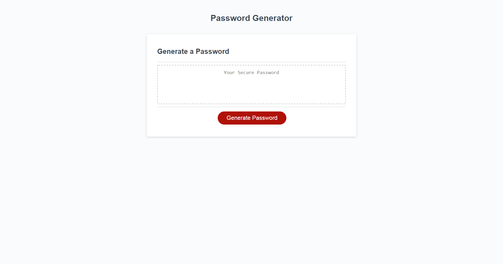

## **Password Generator**
---
 

### **Table of Contents**
---
1. [Installalation](#installation)
1. [Trials](#trials)
1. [Usage](#usage)
1. [Credits](#credits)
1. [License](#license)

### **Installation**
----
The steps taken to implement this project are as follows:

1. Used psuedo code to figure out how many steps would be required.
1. Generated my base arrays that include my alphameric and numeric characters.
1. Provided a number of prompts to ask the user what type of characters they would like in the password to be generated.  Added some validation to ensure the password is within the number of characters and that at least one criteria was choosen.
1. Pushed the chosen criteria's array's into the array of arrays.
1. Used a for loop to run equal to the password length and used math random to find a random character in the chosen array.
1. Returned the password to the above function.

### **Trials**
---
This was my first Javascript assignment.  Finding a way to combine the arrays into one large array and then iterating over both dimensions at once, was challenging, but overall very rewarding.  I feel my grasp on arrays has strengthed considerably.

### **Usage**
---
The site is very simple to use.  You click the button to generate your password.  A couple prompts will be displayed to allow you to choose the criteria needed.

### **Credits**
---

[w3 schools](https://www.w3schools.com/jsref/jsref_dowhile.asp)

### **License**
---

Copyright (c) 2005-2020 David Heinemeier Hansson

Permission is hereby granted, free of charge, to any person obtaining
a copy of this software and associated documentation files (the
"Software"), to deal in the Software without restriction, including
without limitation the rights to use, copy, modify, merge, publish,
distribute, sublicense, and/or sell copies of the Software, and to
permit persons to whom the Software is furnished to do so, subject to
the following conditions:

The above copyright notice and this permission notice shall be
included in all copies or substantial portions of the Software.

THE SOFTWARE IS PROVIDED "AS IS", WITHOUT WARRANTY OF ANY KIND,
EXPRESS OR IMPLIED, INCLUDING BUT NOT LIMITED TO THE WARRANTIES OF
MERCHANTABILITY, FITNESS FOR A PARTICULAR PURPOSE AND
NONINFRINGEMENT. IN NO EVENT SHALL THE AUTHORS OR COPYRIGHT HOLDERS BE
LIABLE FOR ANY CLAIM, DAMAGES OR OTHER LIABILITY, WHETHER IN AN ACTION
OF CONTRACT, TORT OR OTHERWISE, ARISING FROM, OUT OF OR IN CONNECTION
WITH THE SOFTWARE OR THE USE OR OTHER DEALINGS IN THE SOFTWARE.

